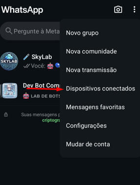
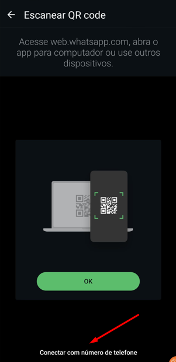
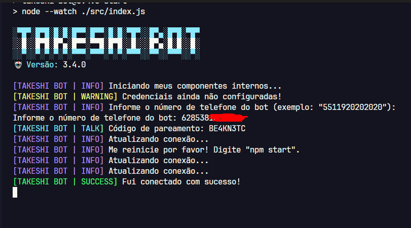

# 🤖 Takeshi Bot

<div align="center">
    
</div>

<br />

<div align="center">
    <a href="https://github.com/guiireal/takeshi-bot">
        
    </a>
</div>

<br />

## Multifunctional WhatsApp bot, developed in the video:

[CREATING A WHATSAPP BOT FROM SCRATCH (DEFINITIVE GUIDE) - COMPLETE BASE + 6 COMMANDS - JAVASCRIPT](https://youtu.be/6zr2NYIYIyc)


## 🌐 Access Takeshi Bot in other languages

<ul style="list-style: none; padding-left: 0;">
  <li>
    
    <strong>Português (BR)</strong> — <a href="https://github.com/guiireal/takeshi-bot">clique aqui</a>
  </li>
  <li>
    
    <strong>Español</strong> — <a href="https://github.com/guiireal/takeshi-bot-espanol">haz clic aquí</a>
  </li>
  <li>
    
    <strong>Bahasa Indonesia</strong> — <a href="https://github.com/guiireal/takeshi-bot-bahasa-indonesia">klik disini</a>
  </li>
</ul>

## 💻 Technologies involved

- [Axios](https://axios-http.com/ptbr/docs/intro)
- [Baileys 6.7.18](https://github.com/WhiskeySockets/Baileys)
- [FFMPEG](https://ffmpeg.org/)
- [Node.js >= 22.14.0](https://nodejs.org/en)
- [Spider X API](https://api.spiderx.com.br)

## ⚠ Warning

We do not provide free support if you have acquired this base from third parties and have paid for it. Request that **the person who sold you the bot provide you with support**. We have no link with third parties and are not responsible for it, nor do we provide support under these conditions.

If your bot is the official Bronxys bot, interact with us and receive support through the group:
[https://chat.whatsapp.com/J5OewHvweK1Kf7RGXAwIYM](https://chat.whatsapp.com/J5OewHvweK1Kf7RGXAwIYM)

## About this project

This project has no official link with WhatsApp. It was developed independently for automated interactions through the platform.

We are not responsible for any misuse of this bot. It is the user's sole responsibility to ensure that its use complies with WhatsApp's terms of use and current legislation.

## Installation on Termux

1 - Open Termux and run the following commands.
_Don't have Termux? [Click here to download the latest version](https://www.mediafire.com/file/082otphidepx7aq/Termux_0.119.1_aldebaran_dev.apk) or [click here to download the Play Store version](https://play.google.com/store/apps/details?id=com.termux) if the previous MediaFire version doesn't work._

```sh
pkg upgrade -y && pkg update -y && pkg install git -y && pkg install nodejs-lts -y && pkg install ffmpeg -y
````

2 - Enable access to the storage folder in Termux.

```sh
termux-setup-storage
```

3 - Enter the sdcard folder.

```sh
cd /sdcard
```

4 - Clone the repository.

```sh
git clone https://github.com/guiireal/takeshi-bot-espanol.git
```

5 - Enter the cloned folder.

```sh
cd takeshi-bot
```

6 - Enable read and write permissions (do this step only once).

```sh
chmod -R 755 ./*
```

7 - Run the bot.

```sh
npm start
```

8 - Insert the phone number and press `enter`.

9 - Enter the code that appears in Termux into your WhatsApp, [see here if you can't find this option](https://youtu.be/6zr2NYIYIyc?t=5395).

10 - Wait 10 seconds, then type `CTRL + C` to stop the bot.

11 - Configure the `config.js` file located inside the `src` folder.

```js
// Command prefix
exports.PREFIX = "/";

// Bot emoji (change if you prefer).
exports.BOT_EMOJI = "🤖";

// Bot name (change if you prefer).
exports.BOT_NAME = "Takeshi Bot";

// Bot number. Put the bot number
// (numbers only, exactly as it appears in WhatsApp).
exports.BOT_NUMBER = "558112345678";

// Bot owner number. Put the bot owner number
// (numbers only, exactly as it appears in WhatsApp).
exports.OWNER_NUMBER = "5521950502020";

// Bot owner LID.
// To get the bot owner LID, use the <prefix>get-lid @mention or +owner phone command.
exports.OWNER_LID = "219999999999999@lid";
```

12 - Start the bot again.

```sh
npm start
```

## Installation on VPS (Debian/Ubuntu)

1 - Open a new terminal and run the following commands.

```sh
sudo apt update && sudo apt upgrade && sudo apt-get update && sudo apt-get upgrade && sudo apt install ffmpeg
```

2 - Install `curl` if you don't have it.

```sh
sudo apt install curl
```

3 - Install `git` if you don't have it.

```sh
sudo apt install git
```

4 - Install NVM.

```sh
curl -o- https://raw.githubusercontent.com/nvm-sh/nvm/v0.40.3/install.sh | bash
```

5 - Update your environment source.

```sh
source ~/.bashrc
```

6 - Install the latest version 22 of Node.js.

```sh
nvm install 22
```

7 - Check if the version was installed and is active.

```sh
node -v # Should show version 22
```

8 - Check if npm was installed together.

```sh
npm -v # Should show npm version
```

9 - Install PM2 (recommended).

```sh
npm install pm2 -g
```

10 - Clone the bot repository wherever you want.

```sh
git clone https://github.com/guiireal/takeshi-bot-espanol.git
```

11 - Enter the cloned folder.

```sh
cd takeshi-bot
```

12 - Type the following command.

```sh
npm start
```

13 - The bot will ask you to enter your phone number.
Enter **exactly** as it appears in WhatsApp and numbers only.


14 - Connect the bot to PM2.

```sh
pm2 start npm --name "takeshi-bot" -- start
```

15 - The bot will show a **pairing code** that should be placed in `linked devices` in your WhatsApp.


16 - Go to `linked devices` in your WhatsApp.



17 - Click on `Link a device`.


18 - In the bottom corner, click on `Link with phone number`.



19 - Enter the **pairing code** you received in the terminal, which was generated in step `15`.


20 - After this, in the terminal that was stopped, it should show that it **connected successfully**.



21 - Type `CTRL + C` to stop the bot.

22 - Now, start it with `PM2`, running the following code.

```sh
pm2 start npm --name "takeshi-bot" -- start
```


23 - Configure the `config.js` file located inside the `src` folder.

```js
// Command prefix
exports.PREFIX = "/";

// Bot emoji (change if you prefer).
exports.BOT_EMOJI = "🤖";

// Bot name (change if you prefer).
exports.BOT_NAME = "Takeshi Bot";

// Bot number. Put the bot number (numbers only).
exports.BOT_NUMBER = "5511920202020";

// Bot owner number. Put the bot owner number (numbers only).
exports.OWNER_NUMBER = "5511999999999";
```

24 - Finally, test the bot!


## Some commands require API

Edit the `config.js` file located inside the `src` folder and paste your API key from the Spider X API platform, according to the code below.
To get your token, access: [https://api.spiderx.com.br](https://api.spiderx.com.br) and create your account for free!

```js
exports.SPIDER_API_TOKEN = "your_token_here";
```

## General functionalities

| Function | Context | Requires Spider X API?
| ------------ | --- | ---
| Change bot image | Owner | ❌
| Execute infrastructure commands | Owner | ❌
| Get group ID | Owner | ❌
| Turn bot off in group | Owner | ❌
| Turn bot on in group | Owner | ❌
| Admins only | Admin | ❌
| Anti-link | Admin | ❌
| Ban members | Admin | ❌
| Change group name | Admin | ❌
| Clear chat | Admin | ❌
| Close group | Admin | ❌
| Delete messages | Admin | ❌
| Enable/disable auto-response | Admin | ❌
| Enable/disable group exit | Admin | ❌
| Enable/disable welcome | Admin | ❌
| Mention everyone | Admin | ❌
| Mute/unmute | Admin | ❌
| Open group | Admin | ❌
| Reveal | Admin | ❌
| Schedule message | Admin | ❌
| AI image generation | Member | ✅
| AI sticker | Member | ✅
| Animated text sticker | Member | ✅
| Black/white image | Member | ❌
| Blur image | Member | ❌
| Contrast image | Member | ❌
| Fake chat | Member | ❌
| Fun/game commands | Member |❌
| Generate link | Member | ❌
| Google Gemini | Member | ✅
| Google Search | Member | ✅
| Invert canvas | Member | ✅
| Mirror image | Member | ❌
| Ping | Member | ❌
| PixArt AI image | Member | ✅
| Pixelated image | Member | ❌
| Play audio | Member | ✅
| Play video | Member | ✅
| Prison canvas | Member | ✅
| Rename sticker | Member | ❌
| RIP canvas | Member | ✅
| Stable Diffusion Turbo AI image | Member | ✅
| Sticker | Member | ❌
| Sticker to image | Member | ❌
| TikTok video download | Member | ✅
| YT MP3 | Member | ✅
| YT MP4 | Member | ✅
| YT Search | Member | ✅

## Send functionalities (Examples)

### 🎵 Audio examples

| Command | Function | Description | Features |
|---------|---------|-----------|-----------------|
| `/send-audio-from-file` | Send audio from file | Demonstrates sending audio files from local storage | Voice message option, quoted reply |
| `/send-audio-from-url` | Send audio from URL | Demonstrates sending audio files from external URLs | Voice message option, quoted reply |
| `/send-audio-from-buffer` | Send audio from buffer | Demonstrates sending audio files from memory buffers | Voice message option, quoted reply, file or URL buffer |

### 🖼️ Image examples

| Command | Function | Description | Features |
|---------|---------|-----------|-----------------|
| `/send-image-from-file` | Send image from file | Demonstrates sending image files from local storage | Support for custom caption, mentions, quoted reply |
| `/send-image-from-url` | Send image from URL | Demonstrates sending image files from external URLs | Direct sending from URL, support for mentions, quoted reply |
| `/send-image-from-buffer` | Send image from buffer | Demonstrates sending image files from memory buffers | File or URL buffer, optional caption, mentions, quoted reply |

### 🎬 Video examples

| Command | Function | Description | Features |
|---------|---------|-----------|-----------------|
| `/send-video-from-file` | Send video from file | Demonstrates sending video files from local storage | Support for custom caption, mentions, quoted reply |
| `/send-video-from-url` | Send video from URL | Demonstrates sending video files from external URLs | Direct sending from URL, support for mentions, quoted reply |
| `/send-video-from-buffer` | Send video from buffer | Demonstrates sending video files from memory buffers | File or URL buffer, optional caption, mentions, quoted reply |

### 🎞️ GIF examples

| Command | Function | Description | Features |
|---------|---------|-----------|-----------------|
| `/send-gif-from-file` | Send GIF from file | Demonstrates sending GIF files from local storage | Support for caption, mentions, quoted reply |
| `/send-gif-from-url` | Send GIF from URL | Demonstrates sending GIF files from external URLs | Support for caption, mentions, quoted reply |
| `/send-gif-from-buffer` | Send GIF from buffer | Demonstrates sending GIF files from memory buffers | File or URL buffer, caption, mentions, quoted reply |

### 🎭 Sticker examples

| Command | Function | Description | Features |
|---------|---------|-----------|-----------------|
| `/send-sticker-from-file` | Send sticker from file | Demonstrates sending sticker files from local storage | WebP format |
| `/send-sticker-from-url` | Send sticker from URL | Demonstrates sending sticker files from external URLs | WebP format |
| `/send-sticker-from-buffer` | Send sticker from buffer | Demonstrates sending sticker files from memory buffers | File or URL buffer |

### 📊 Poll/voting examples

| Command | Function | Description | Features |
|---------|---------|-----------|-----------------|
| `/send-poll` | Send poll | Demonstrates how to create and send polls/votes in groups | Support for single or multiple selection |

### 📄 Document examples

| Command | Function | Description | Features |
|---------|---------|-----------|-----------------|
| `/send-document-from-file` | Send document from file | Demonstrates sending document files from local storage | MIME type specification, custom filename |
| `/send-document-from-url` | Send document from URL | Demonstrates sending document files from external URLs | MIME type specification, custom filename |
| `/send-document-from-buffer` | Send document from buffer | Demonstrates sending document files from memory buffers | File or URL buffer, MIME type, custom filename |

### 💬 Message examples

| Command | Function | Description | Features |
|---------|---------|-----------|-----------------|
| `/send-text` | Send text | Demonstrates sending simple text messages | Support for mentions |
| `/send-quoted` | Send reply | Demonstrates sending reply messages | Success/error/warning replies |
| `/send-reaction` | Send reactions | Demonstrates sending emoji reactions | Various emoji reactions, success/error/warning reactions |

### 📊 Metadata examples

| Command | Function | Description | Features |
|---------|---------|-----------|-----------------|
| `/get-message-data` | Get message metadata | Demonstrates advanced extraction of message or quoted message metadata | Detailed analysis, support for message reply, technical information, automatic mentions |
| `/get-group-data` | Get group data | Demonstrates extraction of group information | Group metadata, participant list, admin information |
| `/group-functions` | Group functions | Demonstrates usage of group utility functions | Extraction of group name, owner, admins, participants |

### 🎯 Example center

| Command | Function | Description | Features |
|---------|---------|-----------|-----------------|
| `/samples-of-messages` | Example center | Center with list of all available examples | Interactive menu, direct access to all examples |

## Auto response

Takeshi Bot has a built-in auto-responder, edit the file at `./database/auto-responder.json`:

```json
[
    {
        "match": "Hello",
        "answer": "Hello, how are you?"
    },
    {
        "match": "All good",
        "answer": "I'm fine, thanks for asking"
    },
    {
        "match": "What's your name?",
        "answer": "My name is Takeshi Bot"
    }
]
```

## Where is the bot menu?

The bot menu is located in the `src` folder in the file called `menu.js`

## Where do I modify the welcome message and when someone leaves the group?

The messages are located in the `src` folder in the file called `messages.js`

## Technical implementation of examples

### 📁 Location of example commands

All example commands are located at: `src/commands/member/samples/`

### 🛠️ Available functions

All example commands use functions from `src/utils/loadCommonFunctions.js`:

#### Audio functions

  - `sendAudioFromFile(filePath, asVoice, quoted)`
  - `sendAudioFromURL(url, asVoice, quoted)`
  - `sendAudioFromBuffer(buffer, asVoice, quoted)`

#### Image functions

  - `sendImageFromFile(filePath, caption, mentions, quoted)`
  - `sendImageFromURL(url, caption, mentions, quoted)`
  - `sendImageFromBuffer(buffer, caption, mentions, quoted)`

#### Video functions

  - `sendVideoFromFile(filePath, caption, mentions, quoted)`
  - `sendVideoFromURL(url, caption, mentions, quoted)`
  - `sendVideoFromBuffer(buffer, caption, mentions, quoted)`

#### GIF functions

  - `sendGifFromFile(file, caption, mentions, quoted)`
  - `sendGifFromURL(url, caption, mentions, quoted)`
  - `sendGifFromBuffer(buffer, caption, mentions, quoted)`

#### Sticker functions

  - `sendStickerFromFile(filePath, quoted)`
  - `sendStickerFromURL(url, quoted)`
  - `sendStickerFromBuffer(buffer, quoted)`

#### Document functions

  - `sendDocumentFromFile(filePath, mimetype, fileName, quoted)`
  - `sendDocumentFromURL(url, mimetype, fileName, quoted)`
  - `sendDocumentFromBuffer(buffer, mimetype, fileName, quoted)`

#### Message functions

  - `sendText(text, mentions)`
  - `sendReply(text, mentions)`
  - `sendReact(emoji)`
  - `sendSuccessReply(text, mentions)`, `sendErrorReply(text, mentions)`, `sendWarningReply(text, mentions)`, `sendWaitReply(text, mentions)`
  - `sendSuccessReact()`, `sendErrorReact()`, `sendWarningReact()`, `sendWaitReact()`

#### Group utility functions

  - `getGroupMetadata()` - Get complete group metadata
  - `getGroupName()` - Get only group name
  - `getGroupOwner()` - Get group owner information
  - `getGroupParticipants()` - Get all group participants
  - `getGroupAdmins()` - Get group admins

### 🎯 Usage examples with mentions

#### Send image with mentions

```javascript
await sendImageFromFile("./assets/image.jpg", "Hello @5511999999999!", ["5511999999999@s.whatsapp.net"]);

await sendImageFromURL("https://example.com/image.png", 
  "Hello @5511999999999 and @5511888888888!", 
  ["5511999999999@s.whatsapp.net", "5511888888888@s.whatsapp.net"]
);
```

#### Send video with mentions

```javascript
await sendVideoFromFile("./assets/video.mp4", "Check this video @5511999999999!", ["5511999999999@s.whatsapp.net"]);

const buffer = fs.readFileSync("./video.mp4");
await sendVideoFromBuffer(
  buffer, 
  "Special video for @5511999999999 and @5511888888888!", 
  ["5511999999999@s.whatsapp.net", "5511888888888@s.whatsapp.net"]
);
```

#### Send GIF with mentions

```javascript
await sendGifFromFile(
  "./assets/gif.mp4", 
  "Here you go @5511999999999!", 
  ["5511999999999@s.whatsapp.net"]
);
```

### 🎯 TypeScript support

Complete TypeScript definitions are available in `src/@types/index.d.ts` with:

  - Detailed function signatures
  - Parameter descriptions
  - Usage examples
  - Return type specifications

### 📁 Sample files

All sample files are stored in `assets/samples/`:

  - `sample-audio.mp3` - Audio file for testing
  - `sample-document.pdf` - PDF document for testing
  - `sample-document.txt` - Text document for testing
  - `sample-image.jpg` - Image file for testing
  - `sample-sticker.webp` - Sticker file for testing
  - `sample-video.mp4` - Video file for testing

## Folder structure

- 📁 assets ➔ _multimedia files_
    - 📁 auth ➔ _bot connection files_
    - 📁 images ➔ _image files_
        - 📁 funny ➔ _funny GIFs from commands_
    - 📁 samples ➔ _sample files for testing_
    - 📁 temp ➔ _temporary files_
- 📁 database ➔ _data files_
- 📁 node_modules ➔ _Node.js modules_
- 📁 src ➔ _bot source code (usually where you'll spend most of your time)_
    - 📁 @types ➔ _folder where type definitions are located_
    - 📁 commands ➔ _folder where commands are located_
        - 📁 admin ➔ _folder where admin commands are located_
        - 📁 member ➔ _folder where general commands are located (everyone can use them)_
            - 📁 samples ➔ _folder with example commands_
        - 📁 owner ➔ _folder where owner commands are (group and bot)_
        - 📝🤖-how-to-create-commands.js ➔ _example file on how to create a command_
    - 📁 errors ➔ _error classes used in commands_
    - 📁 middlewares ➔ _request interceptors_
    - 📁 services ➔ _various services_
    - 📁 utils ➔ _utilities_
    - 📝 config.js ➔ _bot configuration file_
    - 📝 connection.js ➔ _bot connection script with Baileys library_
    - 📝 index.js ➔ _bot entry point script_
    - 📝 loader.js ➔ _function loading script_
    - 📝 menu.js ➔ _bot menu_
    - 📝 test.js ➔ _test script_
- ⚡-cases-are-here.js ➔ _easter egg_ 
- 📝 index.js ➔ _bot entry point script for hosting_
- 📝.gitignore ➔ _file to not upload certain folders to GitHub_
- 📝LICENSE ➔ _license file_
- 📝package-lock.json ➔ _bot dependency cache file_
- 📝package.json ➔ _bot dependency definition file_
- 📝README.md ➔ _this documentation_

## Common errors

### Operation denied when extracting folder

The error below occurs when downloading the ZIP file directly on the phone with some versions of ZArchiver apk and also on phones without root.

To resolve it, follow the [installation tutorial via git clone](https://www.google.com/search?q=%23installation-on-termux).


### Deleting session files and reconnecting

If any error occurs in the connection, you can delete the files inside the `/assets/auth/baileys` folder.

```sh
rm -rf ./asset/auth/baileys
```

Then, remove the device from WhatsApp by going to WhatsApp settings in "linked devices".

Add a new device again.

### Permission denied when accessing `cd /sdcard`

<br/>


Open Termux, type `termux-setup-storage` and then accept the permissions.

## Subscribe to the channel!

<a href="https://www.youtube.com/@devgui_?sub_confirmation=1" target="_blank" rel="noopener noreferrer"></a>

## License

[GPL-3.0](https://github.com/guiireal/takeshi-bot-espanol/blob/main/LICENSE)

This project is licensed under the GNU General Public License (GPL-3.0).
This means that:

  - You can use this code however you want, whether for personal or commercial projects.
  - You can modify the code to adapt it to your needs.
  - You can share or sell the code, even modified, but you must:
        - Keep credits to the original author (Guilherme França - Dev Gui).
        - Make the modified code available under the same GPL-3.0 license.

What you cannot do:

  - You cannot turn this code into something proprietary (closed) and prevent other people from accessing or using it.

This license ensures that everyone has access to the source code and can collaborate freely, promoting the exchange and improvement of the project.

## ⚠ Disclaimer

In this project, I had to host `node_modules` to help those who run the bot from their phone, as many of them might not run `npm install` correctly through Termux.